# RaspiDaguRover

A basic JSF2 (Java Server Faces) application to control a Rover, [Raspberry Pi](https://www.raspberrypi.org/) based, over a web page.

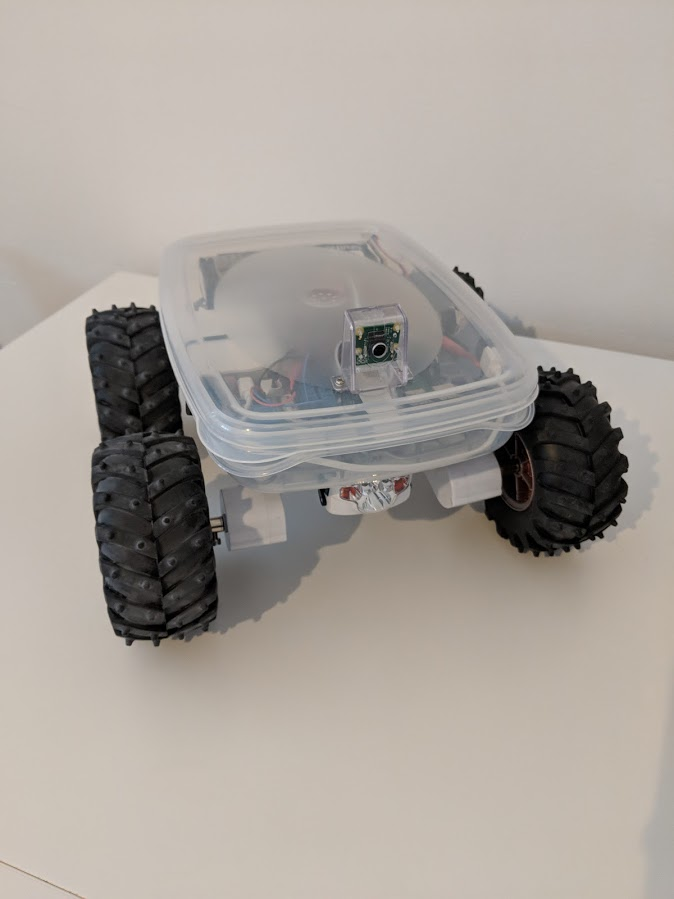

The user (after login) can control rover movements, see environment via camera, switch on/off a frontal lamp.

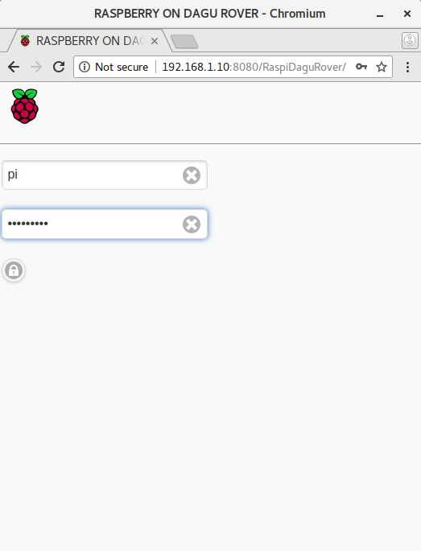

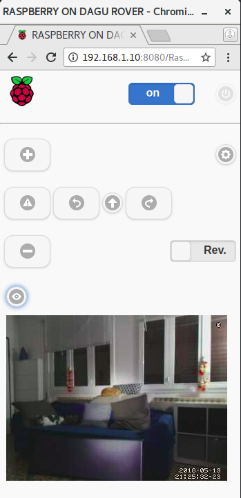

Lost connection cause the rover to stop.

List of materials used to develop this rover solution:

* **Pololu Dagu Rover (with 4 motors)**
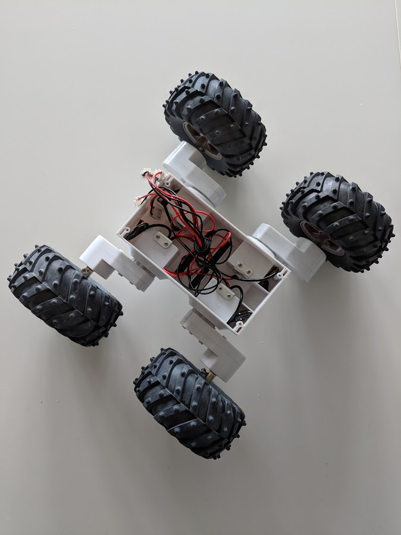

* **Food tapperware**
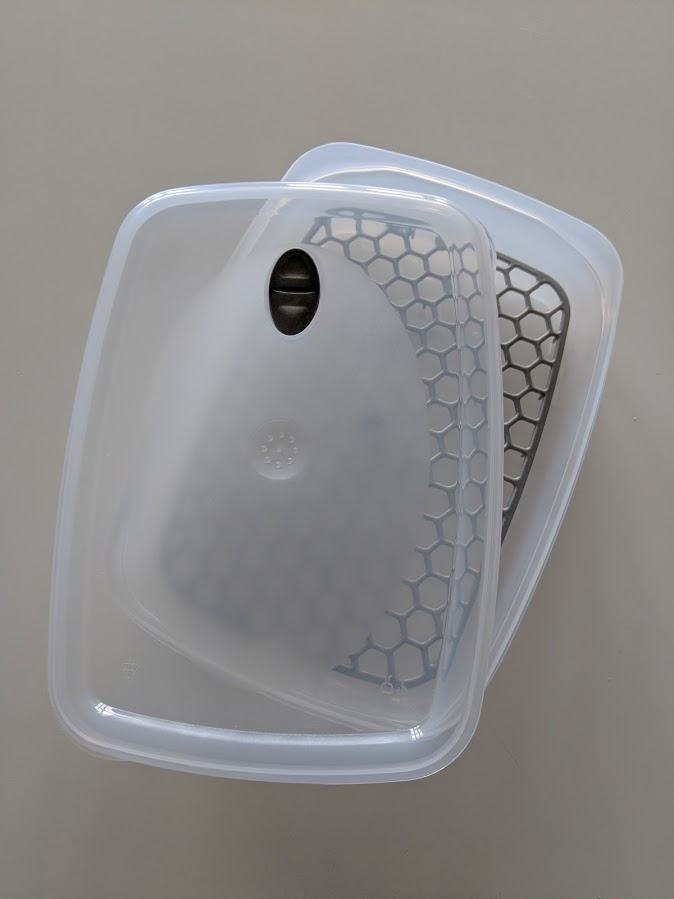

* **Raspberry Pi 3 B Model**
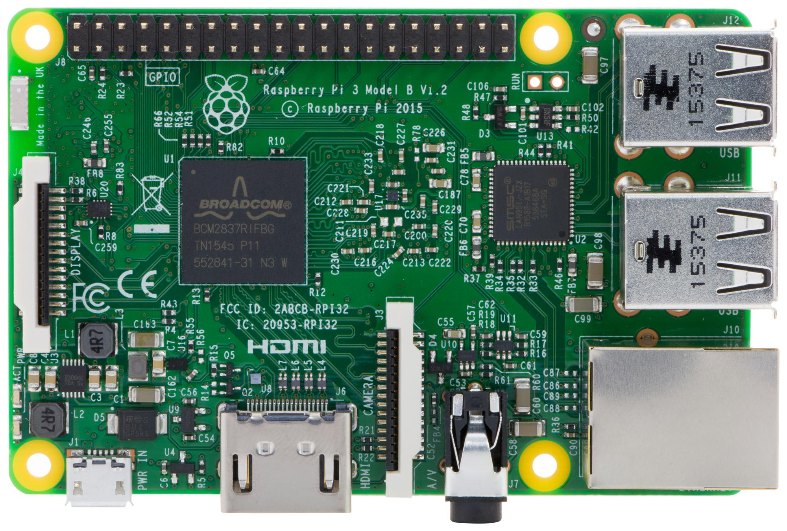

* **Raspberry Pi Camera V2.1**
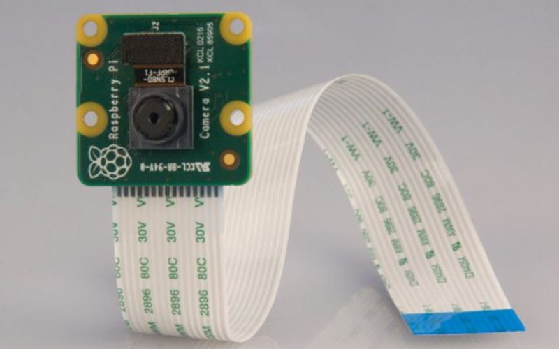

* **Raspberry Pi Camera case**


* **Raspberry supply battery (10000mAh Powerbank)**


* **Raspberry switch**


* **Raspberry restart button**


* **Motors supply battery (5000mAh LiPo battery)**
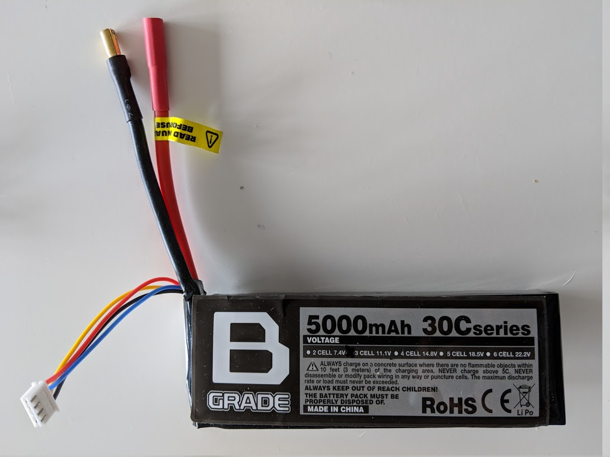

* **4-Channel Motors controller circuit**
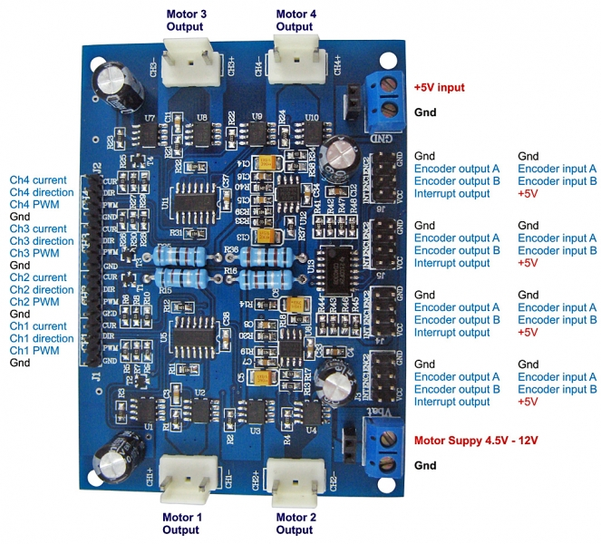

* **Motors power switch**
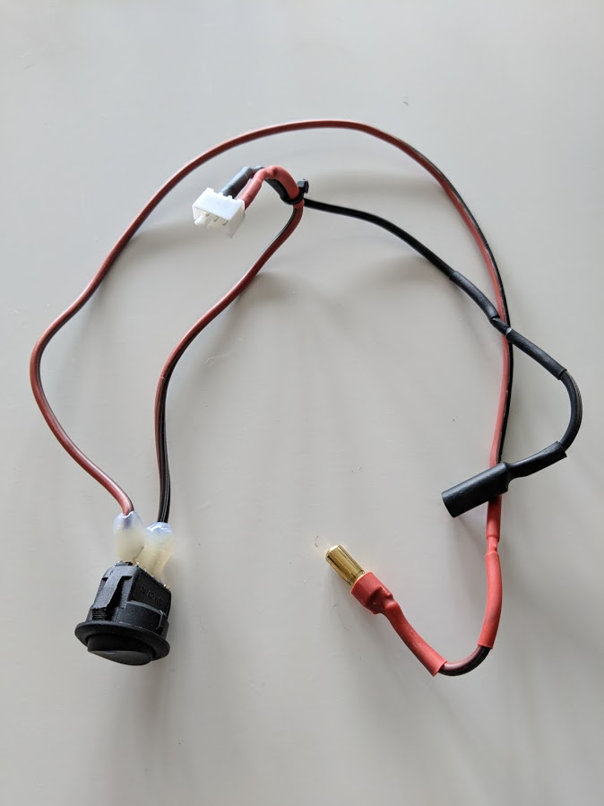

* **Frontal lamp with 3-AAA supply battery**
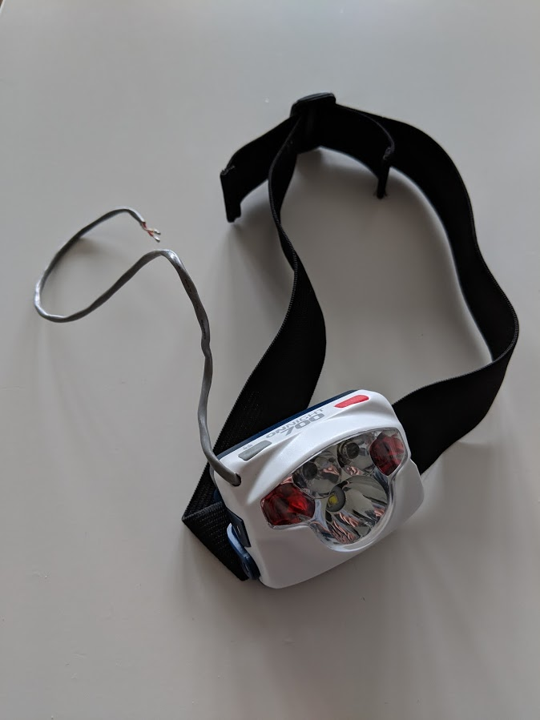

* **Relè to power on-off frontal lamp**
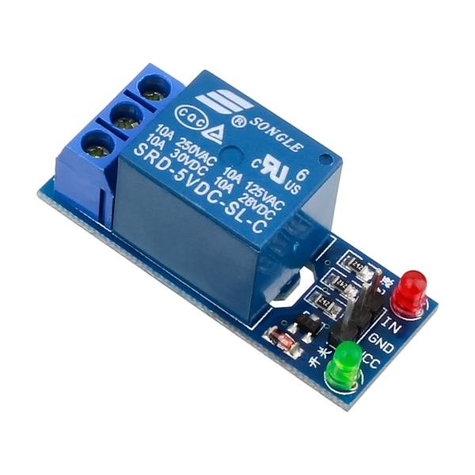

**Connection schema**
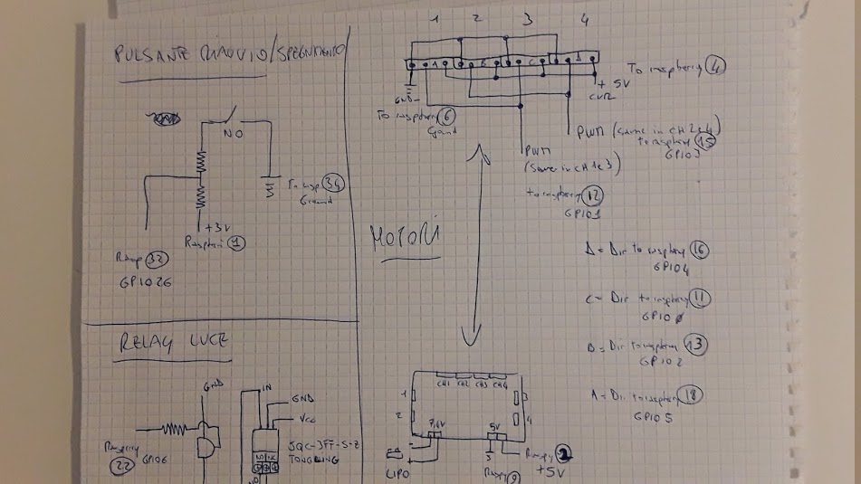

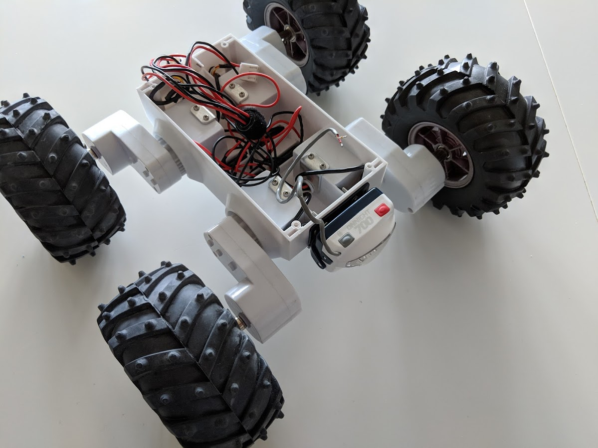

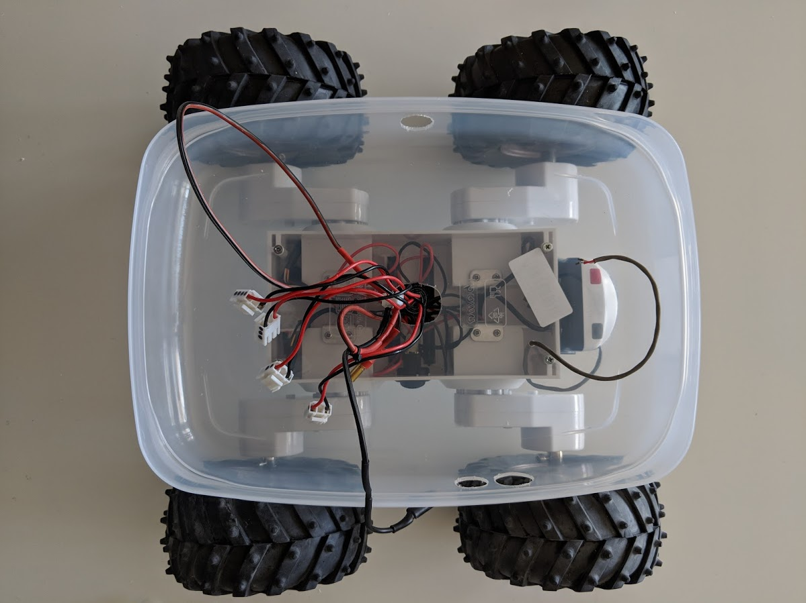

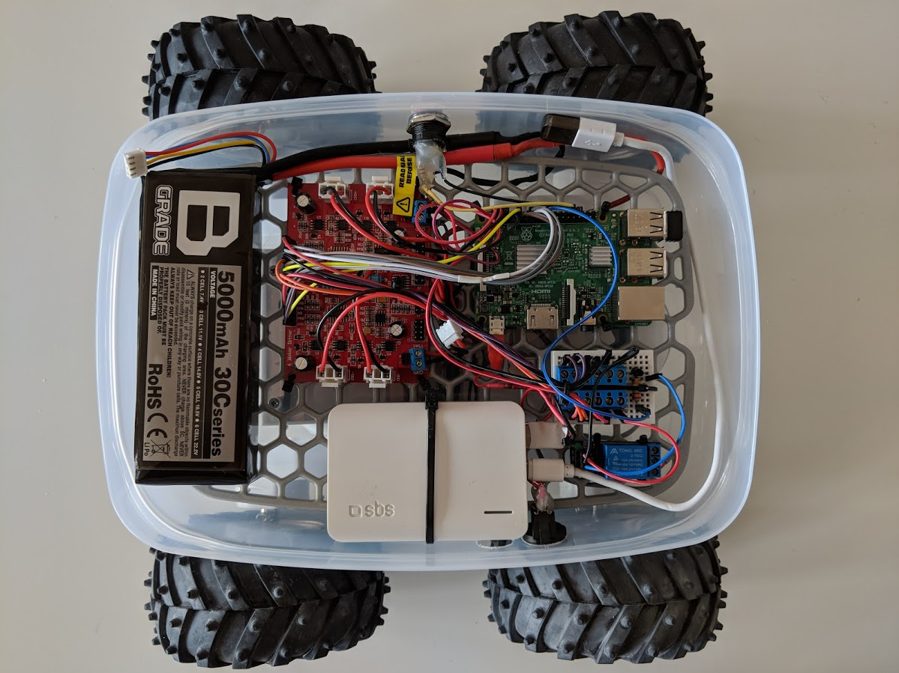

## Running

__as web application__
Export project as a common web application (war archive es. RaspiDaguRover.war) and deploy it:

```sh
java -jar payara-micro.jar --deploy /home/user/RaspiDaguRover.war
```

## Authors 

Franco Parodi <franco.parodi@aol.com>

